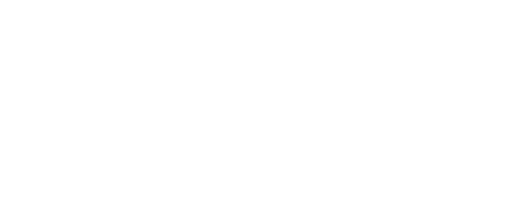

<p align="center">
  <picture>
    <source media="(prefers-color-scheme: dark)" srcset="graphics/apogee-logo-light.svg">
    <source media="(prefers-color-scheme: light)" srcset="graphics/apogee-logo-dark.svg">
    
  </picture>
</p>

A terminal-based coding agent built for **small, locally-run LLMs** (~4B–35B).

Apogee is a single, cross-platform tool that drops into any IDE's integrated
terminal — or any standalone terminal — on Windows, macOS, and Linux. It runs
against any OpenAI-compatible LLM server (llama.cpp, Ollama, LM Studio, vLLM), so
your code stays on your machine, no API key is required for local models, and you
get a full agentic tool-use loop with sensible guardrails.

## What this repo is

Apogee brings together two things most coding agents keep separate:

- **A complete agentic coding assistant** — the *agent loop*, with provider
  abstraction, a ~30-tool suite (file ops, grep/glob, git, terminal, web,
  sub-agents), an MCP client, sessions, four autonomy modes (Plan / Ask-Before /
  Allow-Edits / Auto), and security guardrails.
- **Self-regulating mechanisms for small models** — features that make small,
  locally-run models measurably better at sustained agentic coding: context
  compression, tool-call validation + auto-retry, behavioural nudges, and a
  cross-session learning *Library*. Each is gated so it only fires when the model
  needs it.

These mechanisms run *inside* the agent loop, where they have the most leverage —
not in a separate proxy. And nothing is carried forward on faith: every mechanism
is measured and A/B-tested against real local models with an eval/simulation
harness before it earns a place in the loop.

## Why Go

Portability is the primary goal. Go cross-compiles to a single static binary with
no runtime — the gold standard for "drop into any terminal on any OS." It also lets
us use **one language for both the agent and the bench that evaluates it**. The TUI
is built on the Charm stack (Bubble Tea + Lipgloss + Bubbles) with Cobra for the CLI.

## Status

**`v1.0.0` shipped (2026-06-25).** The embeddable agent core is stable — the public
Go API follows semver from `v1.0.0` — with the full tool suite, MCP client,
sub-agents, and OS-confined Auto mode (Linux landlock / macOS seatbelt; Windows
confinement comes in a later phase, so Auto is not yet available there). Current
work is the apogee-code feature-parity track: skills, context compaction
(`/compact`), out-of-the-box web search, and model profiles have landed since.
See [`docs/plans/`](docs/plans/) and the [`CHANGELOG`](CHANGELOG.md) for what's
next.

## Key capabilities

- **Model-agnostic, local-first** — any OpenAI-compatible endpoint; zero data leaves
  your machine with a local model.
- **Agentic tool use** — multi-step loop with file edits, shell, search, git, web,
  and sub-agents.
- **Four autonomy modes** — Plan (read-only), Ask-Before (writes need approval),
  Allow-Edits (workspace-scoped writes auto-approved), Auto (autonomous, confined
  at the OS level via Linux landlock / macOS seatbelt).
- **MCP support** — connect external tool servers over stdio / SSE / streamable-http.
- **Model profiles** — adapt to models that don't speak native tool-calls: the tool
  menu and format instructions are injected as text on the request side, markdown-fenced
  or custom-regex tool calls are parsed back out of the reply, and inline thinking /
  harmony channels are stripped — all driven by a per-model profile (native models
  stay byte-identical on the wire).
- **Small-model mechanisms** — context compaction has landed; tool-call
  validation/auto-retry, syntax + autofix, behavioural nudges, and the cross-session
  Library are the roadmap — each gated so it only fires when the model needs it.
- **Validated, not assumed** — every mechanism is A/B-tested against real local models
  via an eval/simulation bench (which imports Apogee as a Go library and drives
  the real loop in-process) before it earns a place in the loop.

## Configuration

Settings resolve by precedence, highest first: a command-line flag overrides an
`APOGEE_*` environment variable, which overrides `~/.apogee/config.yaml`, which
overrides the built-in default. A fully-commented starter `config.yaml` is written
to `~/.apogee` on first run (your edits are never overwritten). Some settings are
**file-only** (no flag or env) — the model profile, MCP servers, web-search
endpoint, and the small-model mechanisms.

Catalogued mechanisms are opt-in by canonical ID. Every mechanism ships **off**
until its A/B bench run proves it a win, so enabling one is a deliberate config
choice:

```yaml
# ~/.apogee/config.yaml
mechanisms:
  validate: true   # tool-call validation + auto-retry
  syntax: true     # write-content syntax check
  autofix: true    # formatter pass on tool-call payloads
```

An unknown ID is a startup error that lists the IDs this build knows; `--bypass`
still wins (an enabled non-off-ramp mechanism does not fire under bypass). The
catalogue fills in as the port waves land — see
[`docs/design/mechanism-catalogue.md`](docs/design/mechanism-catalogue.md).

## Building from source

**Prerequisites:** Go 1.26+ (the toolchain version pinned in `go.mod`).

```bash
git clone https://github.com/airiclenz/apogee.git
cd apogee
make build      # compiles ./apogee
./apogee --help
```

A `Makefile` wraps the common Go invocations:

| Command | Does |
|---|---|
| `make build` | Compile the binary to `./apogee` |
| `make run ARGS="--help"` | Build-and-run, passing flags via `ARGS` |
| `make test` | Run the test suite with the race detector |
| `make cross` | Cross-build all six release targets (Linux/macOS/Windows × amd64/arm64) |
| `make check` | The full acceptance gate — gofmt, vet, build, race tests, cross-build |
| `make help` | List every target |

Prefer the raw toolchain? `go build -o apogee ./cmd/apogee` does the same thing — the
Makefile just gives the common commands one-word names.

> **Note:** launch the TUI with `apogee --endpoint <openai-compatible-url> --model <name>`
> to hold a real coding conversation with a local model. All four autonomy modes, the
> full tool suite, MCP, sub-agents, and skills are live; Auto mode needs OS confinement
> (Linux and macOS today — Windows lands in a later phase).

## License

MIT — see [LICENSE](LICENSE).
