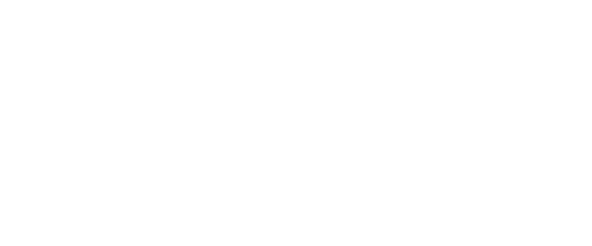
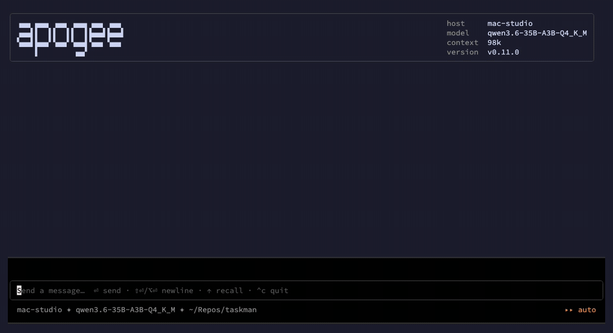

<p align="center">
  <picture>
    <source media="(prefers-color-scheme: dark)" srcset="graphics/apogee-logo-light.svg">
    <source media="(prefers-color-scheme: light)" srcset="graphics/apogee-logo-dark.svg">
    
  </picture>
</p>

A **terminal coding agent**, built for **smaller local models** — while working
even better with bigger ones.

<p align="center">
  
</p>

apogee is an open-source **AI coding assistant that runs in your terminal** —
any terminal, on Windows, macOS, and Linux, including the one inside VS Code,
Zed, or any other IDE. Point it at a **local LLM server** (llama.cpp, Ollama,
LM Studio, vLLM) and your code never leaves your machine — no API key, no
cloud, works offline. Point it at any OpenAI-compatible cloud endpoint instead
and the same agent runs there. Either way you get a real coding agent: it
reads your code, edits files, runs commands and tests, uses git, searches the
web, and delegates to sub-agents — in a loop, until the task is done.

## Why apogee

Three things set it apart from other AI coding agents:

- **Small local models do real work here.** Most agents quietly assume a
  frontier model. apogee ships a set of gated **mechanisms** — context
  compression, tool-call validation with auto-retry, behavioural nudges, a
  cross-session learning *Library* — that fire only when the model needs the
  help, and make small, locally-run models measurably better at sustained
  agentic coding. Nothing is taken on faith: every mechanism is A/B-tested
  against real local models on an eval bench before it earns a place in the
  loop, and the same bench regression-tests every change to what a model sees.
- **Autonomy fenced by the operating system, not by a prompt.** Four autonomy
  modes run from read-only Plan up to unsupervised Auto — and Auto is confined
  at the OS level on all three platforms (Linux landlock, macOS seatbelt, a
  restricted Windows token), so an unsupervised agent *cannot* write outside
  your workspace, rather than being asked nicely not to. Where the OS
  genuinely cannot enforce the fence, apogee asks before each command instead
  of running it unbounded.
- **A complete agent with a UX that gets out of your way.** The full agentic
  loop — a 27-tool suite (file ops, grep, git, terminal, tests, web,
  sub-agents) plus a default-off Console family (`console_open` and its three
  companions) for the REPLs, shells and dev servers a model keeps alive across
  turns, an MCP client, sessions that survive a crash — inside a
  terminal UI built with care: type your next message while the model streams
  and queue it into the running task, recall any prompt you have sent,
  collapse what you are done reading, click every path it prints, undo the
  agent's file writes one exchange at a time.

Under the hood, apogee is an **embeddable Go engine**, and the TUI is its
first front-end, not its identity: the eval bench drives the same loop
in-process, `apogee headless` and `apogee daemon` are further front-ends over
the same core. That commitment is written down and binding — see
[the north-star decision record](docs/adr/0031-the-local-platform-north-star-binds-every-future-layer-to-the-embeddable-engine.md).

## Install

Three ways in, and all three land the same thing: one static binary, no
runtime beside it.

**Homebrew — macOS and Linux:**

```bash
brew tap airiclenz/tap
brew trust --tap airiclenz/tap   # once per machine, on Homebrew 5.1+
brew install apogee
apogee --version
```

The formula installs the prebuilt binary for your platform — nothing is
compiled, no Go toolchain needed; `brew upgrade apogee` moves you to the next
release. The `brew trust` line is what Homebrew 5.1+ wants before loading a
third-party tap; `brew untrust --tap airiclenz/tap` revokes it.

**A prebuilt archive — Windows, macOS, or Linux, `amd64` or `arm64`.** Every
release carries all six targets on the
[releases page](https://github.com/airiclenz/apogee/releases/latest), each
archive with a `SHA256SUMS` file beside it.

```bash
# macOS / Linux — set these two to your release and platform
VERSION=0.15.0
PLATFORM=darwin_arm64   # or darwin_amd64 · linux_amd64 · linux_arm64

curl -fsSLO "https://github.com/airiclenz/apogee/releases/download/v$VERSION/apogee_${VERSION}_${PLATFORM}.tar.gz"
tar -xzf "apogee_${VERSION}_${PLATFORM}.tar.gz"
sudo install -m 0755 "apogee_${VERSION}_${PLATFORM}/apogee" /usr/local/bin/apogee
apogee --version
```

On Windows, download `apogee_<version>_windows_arm64.zip` (or `_amd64`),
unpack it, and put `apogee.exe` somewhere on your `PATH`.

The binaries are **not code-signed** yet: on macOS, a *browser* download is
quarantined — `xattr -d com.apple.quarantine ./apogee` clears that (the `curl`
above never sets it) — and Windows SmartScreen may warn about an unrecognised
publisher. `SHA256SUMS` is the check actually worth making.

**From source:** a clone plus `make build` — see
[Building from source](docs/manual/building.md). One warning:
`go install …@main` works, but **never `@latest`** — proxy.golang.org
immutably retains retired `v1.x` versions, so `@latest` resolves to a stale
build.

## Quick start

```bash
apogee
```

On first run apogee writes a documented starter config to `~/.apogee/` and
asks which server to talk to. Or skip the config entirely and point one
session straight at a server — no GPU needed, a free OpenRouter model will do
(a key is at [openrouter.ai/keys](https://openrouter.ai/keys)):

```bash
export APOGEE_API_KEY=sk-or-your-key
apogee --endpoint https://openrouter.ai/api --model google/gemma-4-31b-it:free
```

or a local one:

```bash
apogee --endpoint http://localhost:8080 --model qwen3-coder
```

Then just describe what you want done. `Shift+Tab` cycles the autonomy mode —
Plan (read-only) → Ask-Before → Allow-Edits → Auto — `/` opens the command
menu, `@` references a file, and `esc` stops a run. The full tour is in
[the manual](docs/manual/README.md).

## Features

- **Local-first, cloud-capable** — any OpenAI-compatible endpoint: a local
  llama.cpp, Ollama, LM Studio, or vLLM server keeps every byte on your
  machine and needs no API key; a keyed remote endpoint is one `api-key` (or
  `api-key-cmd:` / `api-key-env:` — the token can stay in your password
  manager or keychain) on its `servers:` entry away.
- **Agentic tool use** — a multi-step loop with file edits, shell, search,
  git-aware file operations, test runners, web access, and parallel
  sub-agents that can run on a server of their own.
- **Four autonomy modes** — from read-only Plan to OS-confined Auto;
  [Auto's blast radius](docs/manual/configuration.md#auto-modes-blast-radius)
  explains exactly what the fence covers on each platform.
- **Type — and select — while it works** — the prompt box stays live during a
  run: queue your next message into the running task, walk back through every
  prompt you have sent, select transcript text mid-stream.
- **Sessions that survive anything** — every completed turn autosaves;
  `apogee --continue` resumes where you left off, `/sessions` browses
  everything, and an interrupted task picks up with `/continue`. See
  [Sessions](docs/manual/sessions.md).
- **`/undo`** — put back the files the agent wrote, one exchange at a time,
  with a preview before anything is touched.
- **Model profiles** — adapt to models that don't speak native tool calls:
  tool menus injected as text, fenced or custom-regex calls parsed back out,
  thinking channels stripped, reasoning effort set per model — while native
  models stay byte-identical on the wire. A per-model profile can also carry
  its own tool roster, so a small model sees fewer, clearer tools — or more of
  them where one asked for it: a qwen3.8 build is offered the default-off
  Console family out of the box, and nothing else is.
- **Small-model mechanisms** — context compaction is built in and structural,
  not one of them; all 21 catalogued mechanisms ship off until bench evidence
  turns them on, and Validated sets apply the measured winners per model
  automatically.
- **MCP support** — connect external tool servers over stdio, SSE, or
  streamable-http.
- **A settings screen and a watched config** — `/settings` shows every
  resolved setting and writes one key at a time, comments preserved; edits to
  `~/.apogee/config.yaml` from anywhere apply live to the running session.
- **llama-launcher integration** — `/model` loads, switches, and stops local
  model servers via [llama-launcher](https://github.com/airiclenz/llama-launcher)
  Launch profiles, and apogee can remember your model pick per server.
- **Scheduled prompts** — `/schedule` runs a prompt on a cycle while apogee is
  open; [`apogee daemon`](docs/manual/daemon.md) keeps standing schedules
  running under your OS's supervisor, every firing saved as a browsable
  session.
- **Scriptable** — [`apogee headless`](docs/manual/headless.md) runs one
  prompt unattended with clean stdout and meaningful exit codes;
  [`apogee probe`](docs/manual/probe.md) reports what this host, model, and
  terminal can actually do without running an agent.
- **Deliverables you actually see** — a finished report is opened on your
  desktop, or served over a one-off link when apogee runs on a remote box.
- **Colours you choose** — colour schemes as single YAML files, switchable
  live, with your own schemes beside the built-in `dark` and `light`.

## Documentation

The [manual](docs/manual/README.md) carries the full reference:

| Page | Covers |
|---|---|
| [Commands](docs/manual/commands.md) | Every in-chat command, skills, `@file` references, the keys, `/undo`, `/settings` |
| [Sessions](docs/manual/sessions.md) | Saving, resuming, browsing, renaming conversations |
| [Configuration](docs/manual/configuration.md) | `config.yaml` end to end: servers, API keys, model profiles, tools, mechanisms, the system prompt, confinement |
| [`apogee probe`](docs/manual/probe.md) | Diagnosing what a host, model, and terminal can do |
| [`apogee headless`](docs/manual/headless.md) | One unattended prompt, for scripts |
| [`apogee daemon`](docs/manual/daemon.md) | Standing schedules that outlive the session |
| [Building from source](docs/manual/building.md) | Prerequisites, Makefile targets, cross-compilation |

Working on this repo *with* a coding agent? [`AGENTS.md`](AGENTS.md) is the
agent-facing map — where the docs live, and the conventions that aren't
derivable from the code.

## Status

**Pre-production `0.x` on `main`.** Under SemVer a `0.x` version makes
no API-stability promise — the Go API may still move while the tool hardens —
but every release ships prebuilt binaries for all six targets and a Homebrew
formula. Functionally the loop is complete: full tool suite, MCP client,
parallel sub-agents, skills, sessions, schedules, and OS-confined Auto mode on
all three platforms. What changed lately lives in the
[CHANGELOG](CHANGELOG.md); what is next lives in [`ISSUES.md`](ISSUES.md).

## Why Go

Portability is the primary goal. Go cross-compiles to a single static binary
with no runtime — the gold standard for "drop into any terminal on any OS."
It also lets us use **one language for both the agent and the bench that
evaluates it**. The TUI is built on the Charm stack (Bubble Tea + Lipgloss +
Bubbles) with Cobra for the CLI.

## License

MIT — see [LICENSE](LICENSE).
